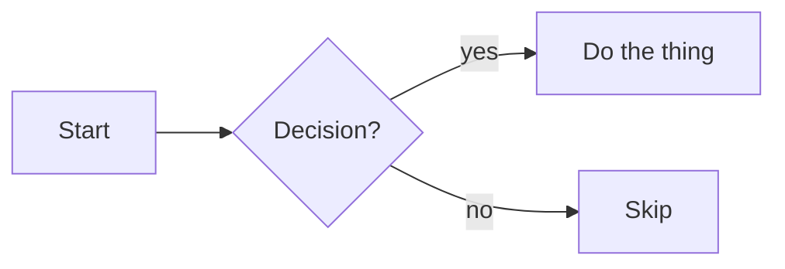

# Mermaid

Mermaid lets you draw diagrams with a text DSL. Note recognizes fenced code blocks tagged `mermaid` and renders them inline as SVG.

## How to insert one

- Type `/mermaid` and the editor inserts a starter block.
- Or write the fence directly:

````markdown

````

## What you can draw

Mermaid supports a wide library of diagram types — see [mermaid-js.github.io](https://mermaid.js.org). The ones most useful in notes:

- **Flowcharts** — boxes and arrows; best for decision trees and process flows.
- **Sequence diagrams** — actor-to-actor message flow over time.
- **State diagrams** — finite state machines.
- **ER diagrams** — entity-relationship for database sketches.
- **Class diagrams** — for OO design notes.
- **Gantt** — timelines / project plans.
- **Pie**, **Quadrant**, **Mind map** — sometimes useful for quick visuals.

The diagram type is set by the first line of the block (`flowchart`, `sequenceDiagram`, `stateDiagram-v2`, `erDiagram`, etc.).

## Render lifecycle

- The Mermaid library is **lazy-loaded** — it doesn't ship in the initial bundle. The first diagram you view triggers the load.
- Each block renders to **SVG**. The rendered SVG isn't saved to disk; only the source text is.
- If your block has a syntax error, the editor shows the error message inline so you can fix it.

## Theming

The diagram inherits Note's color palette. When you switch the [color palette](../14-customization/color-palettes.md) or toggle [theme](../14-customization/theme-toggle.md), Mermaid re-renders to match.

## When Mermaid doesn't fit

- **Pixel-perfect layouts.** Mermaid auto-lays-out; you don't control exact positions. Use [Excalidraw](./excalidraw.md) for free-form drawings.
- **Very large diagrams.** Past a hundred-ish nodes, Mermaid output gets dense. Break the diagram into pieces.
- **Charts with quantitative data.** Use [`/price-chart`](../03-editor/embeds.md) or a code-block + external renderer.

## References

- [[Excalidraw]]
- [[Embeds]]
- [[Color palettes]]
- [[Theme toggle]]
