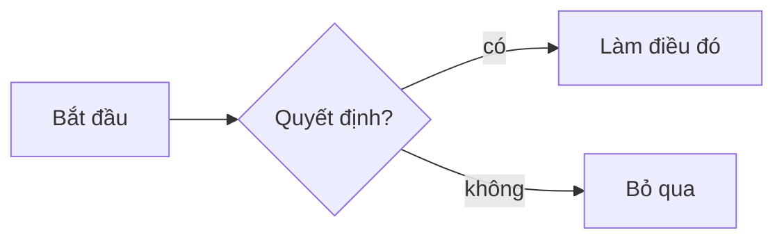

# Mermaid

Mermaid cho phép bạn vẽ biểu đồ với một DSL văn bản. Note nhận khối mã có rào gắn thẻ `mermaid` và render chúng inline thành SVG.

## Cách chèn

- Gõ `/mermaid` và trình soạn thảo chèn một khối khởi đầu.
- Hoặc viết rào trực tiếp:

````markdown

````

## Bạn vẽ được gì

Mermaid hỗ trợ thư viện rộng các loại biểu đồ — xem [mermaid-js.github.io](https://mermaid.js.org). Những cái hữu ích nhất trong ghi chú:

- **Flowcharts** — hộp và mũi tên; tốt nhất cho cây quyết định và luồng quy trình.
- **Sequence diagrams** — luồng tin nhắn giữa actor theo thời gian.
- **State diagrams** — máy trạng thái hữu hạn.
- **ER diagrams** — quan hệ thực thể cho phác thảo cơ sở dữ liệu.
- **Class diagrams** — cho ghi chú thiết kế OO.
- **Gantt** — timeline / kế hoạch dự án.
- **Pie**, **Quadrant**, **Mind map** — đôi khi hữu ích cho hình nhanh.

Loại biểu đồ được đặt bởi dòng đầu của khối (`flowchart`, `sequenceDiagram`, `stateDiagram-v2`, `erDiagram`, …).

## Vòng đời render

- Thư viện Mermaid được **lazy-load** — nó không có trong bundle ban đầu. Biểu đồ đầu tiên bạn xem kích hoạt việc tải.
- Mỗi khối render thành **SVG**. SVG đã render không được lưu lên đĩa; chỉ văn bản nguồn.
- Nếu khối của bạn có lỗi cú pháp, trình soạn thảo hiển thị thông báo lỗi inline để bạn sửa.

## Theming

Biểu đồ kế thừa bảng màu Note. Khi bạn đổi [bảng màu](../14-tuy-bien/bang-mau.md) hoặc bật/tắt [giao diện](../14-tuy-bien/chuyen-giao-dien.md), Mermaid render lại để khớp.

## Khi Mermaid không vừa

- **Bố cục pixel-perfect.** Mermaid tự bố cục; bạn không kiểm soát vị trí chính xác. Dùng [Excalidraw](./excalidraw.md) cho vẽ tự do.
- **Biểu đồ rất lớn.** Vượt quá khoảng một trăm nút, output Mermaid trở nên dày đặc. Chia biểu đồ thành các phần.
- **Biểu đồ với dữ liệu định lượng.** Dùng [`/price-chart`](../03-trinh-soan-thao/nhung.md) hoặc khối mã + renderer ngoài.

## Tham khảo

- [[Excalidraw]]
- [[Nhúng]]
- [[Bảng màu]]
- [[Chuyển giao diện]]
